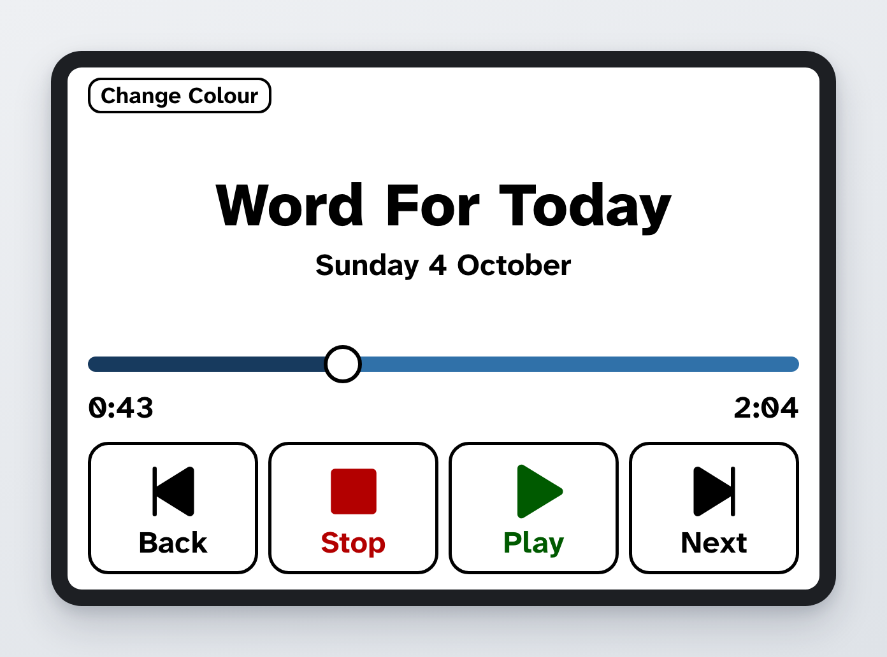

> Originally created for my Granddad to be used on his iPad but now shared publicly as a convenient and accessible audio devotional player.

# Audio Bible Devotions

This web app is for listening to daily Bible devotions.

The goal of this project is to assist those with poor eyesight by providing an
easy-to-use interface with large media controls.

### Preview

### Features

- 5+ Daily audio devotionals
- Dark/Light themes
- Responsive, including zoom and larger text sizes
- Live progress bar
- Lock screen and headphone controls
- Error state when a devotion isn't available yet

## Getting Started

Run `pnpm start` to start the dev server.

Run `pnpm build` to create a production build.

#### Adding additional sources

Add an entry to `SOURCES` in [sources.ts](src/sources.ts) with:

- `name`: shown in the app exactly as written
- `daysBehind`: how many days late the source publishes (0 for today's)
- `url`: builds the recording's link from the day's year, month and day

_Note: The source must update with each day as a daily devotional._

## Built With

- [React](https://react.dev/)
- [TypeScript](https://www.typescriptlang.org/)
- [Vite](https://vite.dev/)
- [StyleX](https://stylexjs.com/)
- [Atkinson Hyperlegible Next](https://www.brailleinstitute.org/freefont/), a
  typeface designed by the Braille Institute for readers with low vision
