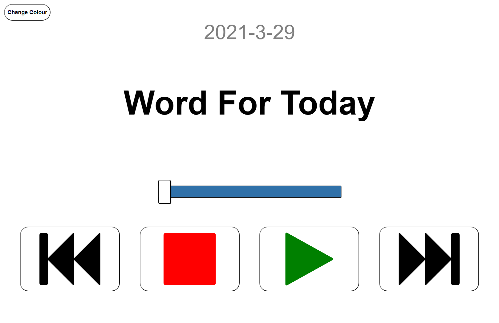

> Originally created for my Granddad to be used on his iPad but now shared publicly as a convenient and accessible audio devotional player.

# Audio Bible Devotions

This web app is for listening to daily Bible devotions.

The goal of this project is to assist those with poor eyesight by providing an
easy-to-use interface with large media controls.

### Preview

### Features

- 5+ Daily audio devotionals
- Dark/Light themes
- Live progress bar

## Getting Started

Run `pnpm start` to start the dev server.

Run `pnpm build` to create a production build.

#### Adding additional sources

Inside [utils.js](src/utils.js):

- Append to the list `getSourceNames` with the name of the source
- Append to the list `getSources` with the link to the source.

_Note: The source must update with each day as a daily devotional._

## Built With

- [React](https://reactjs.org/docs/create-a-new-react-app.html)
- [HTML](https://developer.mozilla.org/en-US/docs/Web/HTML)
- [CSS](https://developer.mozilla.org/en-US/docs/Web/CSS)
- [JavaScript](https://developer.mozilla.org/en-US/docs/Web/JavaScript)

## Author

**Joshua Booth** - [Joshua-Booth](https://github.com/Joshua-Booth)
